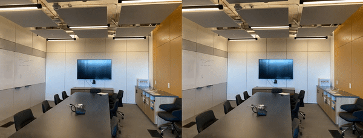

# Há Limites para a Inteligência Artificial?

## Afroya Tech Conf 2023

### Hallison Paz - Programação Dinâmica

<!--  -->

<!-- _class: invert -->
<!-- _paginate: false -->

---

# Quem sou eu?

- Doutorando @IMPA, @Visgraf
- Co-fundador
    @Programação Dinâmica
- Pesquisador em AI Graphics
- Engenheiro de Computação @IME

---

<!--  -->
<!-- _class: invert -->
# O que a Inteligência Artificial faz hoje

----

<!-- - Detecção de objetos -->

### Análise de Imagens
- Detecção de Objetos
- Segmentação
- Identificação

<!-- _footer: https://towardsdatascience.com/real-time-lane-detection-and-alerts-for-autonomous-driving-1f0a021390ee -->

---
### Edição em Imagens 

- Geração de imagens realistas.
- Transferência de Estilo.
- Modificações condicionais.
- Aumento de resolução

<!-- --- -->

<!--  -->
<!--  -->

---

# Imagens para 3D

---
# Avatares Fotorrealistas

---

<!-- _class: invert -->

---

<!-- _class: invert -->
<!-- _paginate: false -->

---

# Ações no espaço

- Movimentação
- Estratégias
- Dinâmica de grupo

<!-- <video src="img/hide-seek-video.mp4" autoplay >
  Desculpa, o seu navegador não suporta vídeos incorporados, mas você pode
  <a href="img/hide-seek-video.mp4">baixá-lo</a>
  e assistir pelo seu reprodutor de mídia favorito!
</video> -->

---

<!-- https://tenor.com/view/boston-dynamics-spot-jumprope-robot-gif-20198938  -->

---

# Simulações físicas

- Solução de equações diferenciais
- Clima
- Fluidos

<!-- _footer: Imagem: https://developer.nvidia.com/blog/physics-ml-platform-modulus-is-now-open-source/ -->

---

---

# Como as máquinas aprendem?

- Representação
- Modelo Computacional
- Medida

---

# O ALUNO MAIS FRACO...

<!-- _class: invert -->

<!-- _paginate: false -->

---

# Inteligência Artificial Limitada (ou Fraca)
#### (Narrow AI)

- Representações, modelos e objetivos muito específicos.

- Mudanças requerem retreinamento.

- "IA" não *compreende* o que faz

<!--  -->

---

# Tarefas bem definidas$^*$ não são um limite!

<!-- _class: invert -->
<!-- _paginate: false -->

---

<!-- _paginate: false -->

<!-- ---
# Se não fosse o marketing...

... boa parte dessas soluções seriam chamadas apenas de "algoritmo" ou "programa".

 -->

<!-- _footer: 3D Gaussian Splatting
for Real-Time Radiance Field Rendering -->

---
#### A G I
# Inteligência Artificial Geral

<!-- _class: invert -->
<!-- _paginate: false -->
<!-- _footer: Luther, Detroit: Become Human -->

---

---

# Podem pensar?

---

###### Em todo caso, existe um limite
# Tudo o que é computável!
<!-- _class: invert -->
<!-- _paginate: false -->

---

---
### Problema leve:
# A gente quer modelar tudo como computável

---

###### Tudo o que somos é computável?
# "O cérebro é um computador"

<!-- _class: invert -->
<!-- _paginate: false -->

----

###### Somos uma máquina determinística?
# "O cérebro é um computador"

<!-- _class: invert -->
<!-- _paginate: false -->

<!-- ---

# Computadores são máquinas determinísticas

"It will seem that given the initial state of the machine and the input signals it is always possible to predict all future states" -->

---

# Estas perguntas não têm respostas (ainda?)

* Talvez nunca tenham uma resposta universalmente aceita

---
### Problema grave
# A gente quer medir tudo pela capacidade de produção

<!-- _class: invert -->

<!-- ---

 -->

---
# Se ninguém quer botar dinheiro, não tem valor.
#### Pensar não tem valor, executar tem
<!-- ##### Você é aquilo que você é capaz de produzir? -->

<!--  -->

---
# Se alguém quer botar dinheiro, tem valor?

---

# Há limites para a inteligência artificial?

1. Certamente: o que é computável
2. Talvez: consciência e pensamento

---

# Faz diferença?

<!-- _class: invert -->
<!-- _paginate: false -->

<!-- ---

---

---

 -->